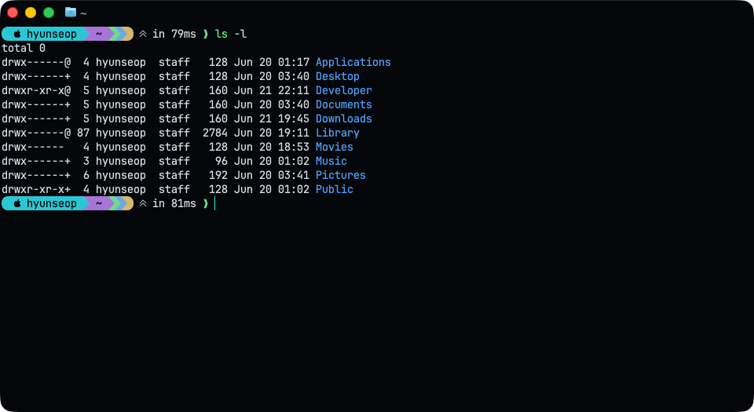
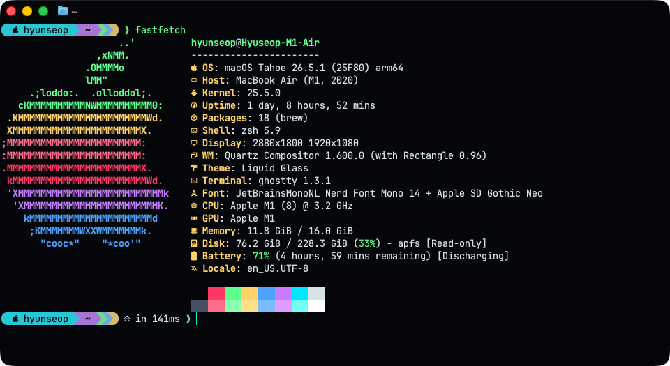
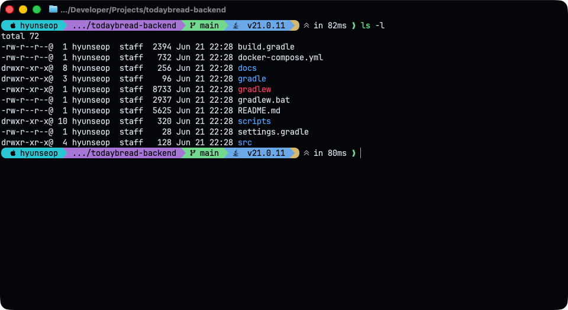
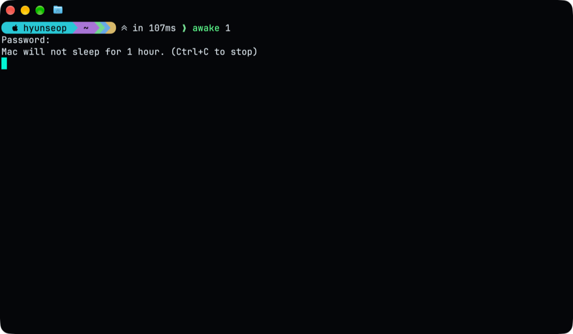
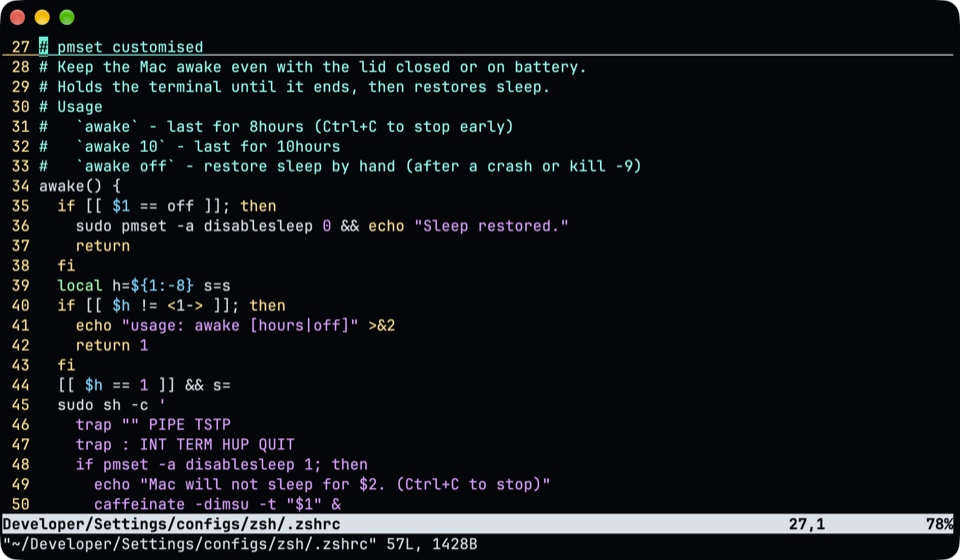
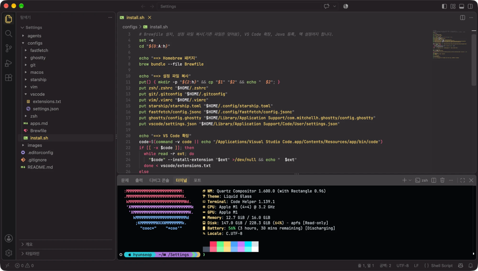

# 개인 Mac 설정

새 맥을 지금 맥과 같게 만드는 설정 모음입니다.



## 설치

1. [configs/apps.md](configs/apps.md)의 앱을 설치합니다. (Ghostty, VS Code, Rectangle 등)
2. [Homebrew](https://brew.sh)를 설치합니다.
3. 저장소를 받습니다.

   ```sh
   git clone https://github.com/hyunseop827/mac-settings.git ~/Developer/Settings
   ```

4. 설치 스크립트를 실행합니다.
   Brewfile, 설정 파일, VS Code 확장, Java, 맥 설정을 한 번에 적용합니다. 기존 설정 파일은 덮어쓰되, 내용이 다르면 `.backup-날짜` 사본을 남깁니다.

   ```sh
   ~/Developer/Settings/configs/install.sh
   ```

5. 직접 마무리합니다.
   - GitHub 로그인: `gh auth login` (SSH 선택)
   - 입력 소스에 한국어 2벌식 추가
   - 다시 로그인 (다크 모드 적용)
   - Rectangle 설정에서 "로그인 시 실행"이 켜져 있는지 확인

## 구성

| 경로 | 내용 |
|---|---|
| `configs/install.sh` | 설치 스크립트 |
| `configs/Brewfile` | Homebrew로 설치하는 CLI, 폰트, Java, 앱 |
| `configs/apps.md` | 직접 설치하는 앱 목록 |
| `configs/macos/defaults.sh` | Dock, Finder, 트랙패드, 다크 모드, Rectangle |
| `configs/zsh/.zshrc` | zsh (`awake` 포함) |
| `configs/starship/starship.toml` | 프롬프트 |
| `configs/ghostty/config.ghostty` | 터미널 |
| `configs/fastfetch/config.jsonc` | 시스템 정보 |
| `configs/vim/.vimrc` | vim |
| `configs/vscode/` | VS Code 설정, 확장 목록 |
| `configs/git/.gitconfig` | git |
| `agents/AGENTS.md` | 에이전트로 앱을 개발·배포할 때 쓰는 규칙 원본 |

`awake`는 뚜껑을 닫아도 맥이 잠들지 않게 합니다. `awake`는 8시간, `awake 10`은 10시간 유지하고 Ctrl+C로 끝냅니다.

`agents/AGENTS.md`의 규칙은 여기서 먼저 고친 뒤 세 앱(Hangeul Filename Fixer, Menu Pulse, Finder Presets)에 문서 PR로 복사합니다.

## 사진

| | |
|---|---|
|  |  |
|  |  |


